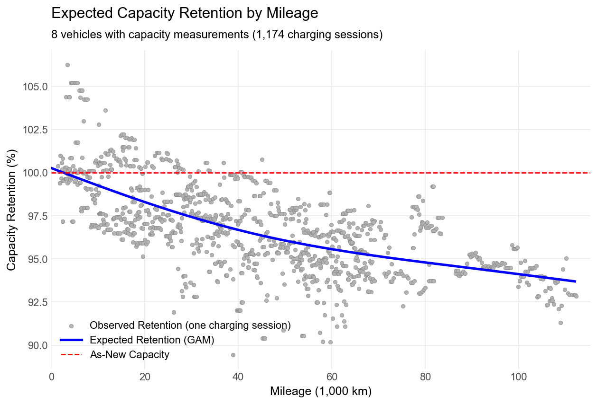
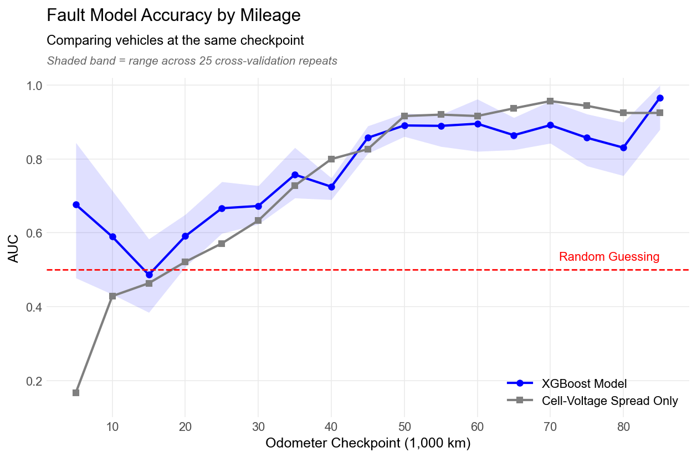
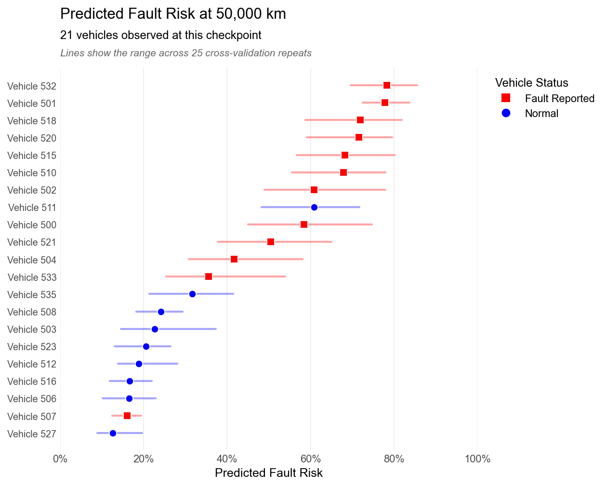

# EV Battery Degradation & Fault Detection Analysis
This project analyzes real charging data from 49 electric vehicles to answer two questions: is a battery aging normally, and is it likely to develop a fault? A GAM predicts capacity decay on vehicles it has never seen within 2.08 percentage points, and an XGBoost model scores fault risk every 5,000 km. At a 50,000 km checkpoint, all 5 of the highest-risk vehicles had fault reports.

---

## Overview
The project is structured around three main components:

1. **Data Processing**
   - Loads 176,327 raw charging snippets (10-second readings of voltage, current, state of charge, cell voltages, and temperatures)
   - Handles sensor glitches, odometer spikes, and idle periods, then combines snippets into 12,378 charging sessions

2. **Degradation Modeling (GAM)**
   - Models expected capacity retention vs. mileage, with a separate baseline for each vehicle
   - Each vehicle's quality score is calculated using residuals:
     ```
     (Observed retention – Expected retention)
     ```
   - Negative scores flag batteries aging worse than a typical pack

3. **Fault Model (XGBoost)**
   - Scores each vehicle every 5,000 km using only data logged up to that point
   - 14 features covering cell-voltage spread, pack temperatures, and charging habits
   - Target: 16 of 49 vehicles with fire-incident or lithium-plating reports

---

## Model Performance

| Model | Metric | Result | Baseline |
|---|---|---|---|
| Degradation GAM | Error on unseen vehicles (RMSE) | 2.08 percentage points | 2.74 percentage points (fleet average) |
| Fault classifier | AUC at matched mileage * | 0.72 | 0.69 (cell-spread alone) |
| Fault classifier | Faulty vehicles in top 5 / top 10 at 50,000 km | 5 of 5 / 9 of 10 | 57% of vehicles faulty |

\* Compares vehicles only at the same odometer checkpoint; ranged 0.67–0.77 across 25 cross-validation repeats

---

## Key Findings
- Expected capacity retention is 96.1% at 50,000 km and 94.1% at 100,000 km
- 3 of 8 capacity-tracked vehicles are aging worse than expected, and one faulty vehicle lost capacity ~5.6 percentage points per 10,000 km faster than expected
- Cell-voltage spread (the gap between a pack's strongest and weakest cells) is the strongest fault signal
- Fault warnings are weak before 20,000 km and strong starting around 45,000 km (AUC mostly 0.86–0.90)
- Fast-charging frequency had almost no effect in either model

---

## Methodology Highlights
- **GAMs** were chosen because capacity fade is non-linear and each effect can be plotted and explained
- **XGBoost** was used for fault detection due to its ability to handle thresholds and interactions, but it was kept small and untuned since only 45 vehicles were usable
- **Grouped cross-validation** splits the data by vehicle, so no vehicle is ever in both training and testing
- **Mileage was excluded** from the classifier since faulty vehicles started being logged at ~11,000 km vs. ~65 km for normal ones; mileage alone has a 0.69 AUC, which is misleading

---

## Data Challenges
- Capacity was only measured for 8 of 49 vehicles, and calculating it from current and state of charge didn't match the dataset's values (r = 0.06), so the GAM solely uses those 8 vehicles
- The original goal of predicting a drop below 80% capacity wasn't possible, since the lowest observed retention was ~89% and there are no calendar dates, so the classifier predicts vehicle fault reports instead
- Corrected erroneous odometer spikes (e.g. a single 1,107,295 km reading) and ignored temperature readings from 1,004 snippets with faulty sensors

---

## Key Takeaway
Battery packs with fault reports show much larger cell imbalance than normal packs, and the gap grows with mileage. Because faulty vehicles only entered the data logs at a higher mileage, a careless model could look accurate just by knowing mileage. Testing only at matched mileage and on unseen vehicles yielded smaller numbers, but they reflect what would actually work for warranty forecasting and proactive service on a real fleet.

---

## Technologies Used
- Python: pandas, NumPy, pickle, concurrent.futures
- Modeling: pyGAM (LinearGAM), XGBoost, scikit-learn (StratifiedGroupKFold, LogisticRegression, roc_auc_score)
- Visualization: matplotlib
- Workflow: Jupyter Notebook, Parquet (pyarrow)

---

## Data
He, Haowei; Zhang, Jingzhao; Wang, Yanan; Jiang, Benben; Huang, Shaobo; Wang, Chen; et al. (2023). EVBattery: A Large-Scale Electric Vehicle Dataset for Battery Health and Capacity Estimation. figshare. Dataset. https://doi.org/10.6084/m9.figshare.23301881.v1

---

## Running the Code
- Download `battery_dataset3.tar.gz` from the dataset link above and extract it into `data/raw/`
- Install packages with `pip install -r requirements.txt`
- Run `clean_data.py`, then `make_charts.py` (runs both models), then `ev_battery_analysis.ipynb`

---

## Visuals



